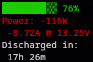

# XiaoXiang

Simple curses widget displaying XiaoXiang BMS info over bluetooth.



# Usage

> __NOTE__: Make sure [poetry](https://python-poetry.org/) is installed on your system.

1. Install dependencies

```
poetry install
```

2. Run the script

```
poetry run xiaoxiang/main.py AA:BB:CC:DD:EE:FF
```

## Options

```
usage: main.py [-h] [-c CAPACITY] address

positional arguments:
  address               BMS Bluetooth address

options:
  -h, --help            show this help message and exit
  -c CAPACITY, --capacity CAPACITY
                        Total battery capacity
```
